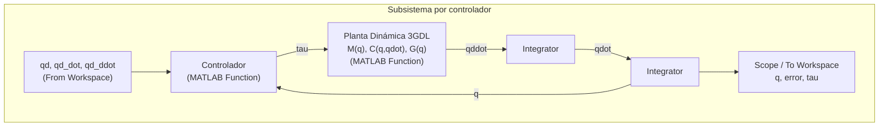

# Trabajo Final — Robot Antropomórfico 3 GDL

Control de un robot antropomórfico de 3 grados de libertad: modelo dinámico por
Jacobianos, tres controladores articulares y planeación autónoma con
obstáculos. Curso: Robótica y Sistemas Autónomos.

---

## 1. Punto de partida

El proyecto parte del trabajo parcial:

```text
00_base_parcial/robot3dof_paper_TParcial_g2.m
```

De ahí se conserva, sin modificar, la base cinemática validada:

- Cinemática directa por parámetros DH (`fk_3dof`).
- Cinemática inversa geométrica (`ik_3dof`).
- Jacobiano translacional del efector y análisis de singularidades
  (`jacobian_3dof`).
- Control cinemático por pseudoinversa amortiguada.

Geometría del robot (tomada del paper base): `L1 = 0.15 m`, `L2 = 0.50 m`,
`L3 = 0.50 m`.

## 2. Qué se agregó para el trabajo final

**Instrucción explícita del docente:** el modelo dinámico *no* se deriva por
Lagrange. Se obtiene por el método alterno visto en clase, centrado en
Jacobianos lineales y angulares de los centros de masa; la matriz de
Coriolis se obtiene con coeficientes de Christoffel (`n = 3`); los tres
controladores se implementan en Simulink.

### 2.1. Modelo dinámico por Jacobianos

Archivo: [`01_codigo_final/robot3dof_TFinal_v2_dinamica_jacobianos.m`](01_codigo_final/robot3dof_TFinal_v2_dinamica_jacobianos.m)

Para cada eslabón *i* se calcula:

- **Centro de masa** `pc_i(q)`.
- **Jacobiano lineal** `Jv_i = d(pc_i)/dq`.
- **Jacobiano angular** `Jw_i` (columnas = ejes de giro de las juntas que
  afectan al eslabón *i*; cero en las juntas posteriores).

Con eso:

```text
M(q)      = Σ_i [ m_i · Jv_i' · Jv_i  +  Jw_i' · R_i · I_i · R_i' · Jw_i ]
C(q,qdot) = coeficientes de Christoffel de M(q), n = 3
G(q)      = d/dq [ Σ_i m_i · g · pc_i,z(q) ]
```

`C(q,qdot)` está implementada **de dos formas independientes**, que se
validaron cruzadas entre sí:

1. **Simbólica** (`coriolis_christoffel`, con `sym`/`diff`, idéntica al
   patrón compartido en clase) — usada para verificación y para el informe.
2. **Numérica** (diferencias centrales sobre `M(q)`, sin Symbolic Math
   Toolbox) — usada en la simulación y obligatoria para los bloques
   `MATLAB Function` de Simulink, que no admiten código simbólico.

Ambas coinciden numéricamente con un error del orden de `1e-10` en el punto
de prueba.

### 2.2. Supuestos físicos (declarados, no inventados en silencio)

El paper base **no** reporta masas, centros de masa ni inercias completas.
Se asumieron y se documentan explícitamente en el encabezado del archivo:

| Parámetro | Valor asumido | Justificación |
|---|---|---|
| `m1, m2, m3` | 2.00, 1.50, 1.00 kg | Orden de magnitud típico de un manipulador de mesa |
| `lc1, lc2, lc3` | `L_i / 2` | Eslabón uniforme → centro de masa a mitad de longitud |
| `I1, I2, I3` | Varilla delgada (`m·L²/12` transversal, ~0 axial) | Aproximación estándar para eslabones esbeltos; el eje "axial" de cada tensor se dedujo de la geometría DH real (no arbitrario, ver comentarios en el código) |
| `g` | 9.81 m/s² | Estándar |

Estos supuestos son la pregunta #1 y #2 pendientes al docente (sección 6).

### 2.3. Validación numérica ya realizada

En la configuración de prueba `q = [30°, 40°, −25°]`, `qdot = [5°, −3°, 4°]/s`:

**M(q)** — simétrica, autovalores `[0.0248, 0.4829, 0.7435]` (los 3 > 0 ⇒ definida positiva):

```text
 0.4829   0.0000   0.0000
 0.0000   0.6849   0.1966
 0.0000   0.1966   0.0833
```

**C(q,qdot):**

```text
 0.0129  -0.0269  -0.0040
 0.0269   0.0037   0.0009
 0.0040   0.0028   0.0000
```

**G(q)** — `G1 = 0` exactamente (el giro de base no cambia energía potencial), como se espera físicamente:

```text
 0.0000
 8.9445
 2.3689
```

Esta validación se corrió por partida doble: derivación simbólica (SymPy vía
paquete `symbolic` de Octave) y la implementación numérica cerrada — ambas
coinciden. También se probó con inercias transversales asimétricas
(`I2 = diag([~0, 10, 20])`) para descartar errores ocultos de orientación en
las matrices de rotación, y el resultado siguió siendo correcto.

**Sanity check físico — dinámica libre (τ = 0):** partiendo de
`q0 = [10°, 20°, −10°]` sin controlador, el robot debe comportarse como un
péndulo doble no amortiguado bajo gravedad:


`q2` y `q3` oscilan sin amortiguamiento (correcto: el modelo no tiene
término disipativo, así que la energía mecánica se conserva). Nótese que
`q1` **no permanece exactamente constante** aunque `G1 = 0` y parte con
velocidad cero: el acoplamiento de Coriolis `C(1,2)`, `C(1,3)` (distinto de
cero) transmite el movimiento de `q2`/`q3` hacia `q1` — un efecto físico
real (similar a la conservación de momento angular de un "gato cayendo") que
el método de Jacobianos captura y que el modelo ad-hoc anterior (v1) no
tenía.

**Configuración de prueba (verificación visual de la cinemática):**


*(Estos dos gráficos se generaron fuera de MATLAB, con un motor numérico
equivalente, solo para verificación visual rápida — no reemplazan correr el
archivo real en MATLAB, ver sección 4.)*

### 2.4. Los tres controladores

Archivo (preparado, pendiente de reescritura con la nueva dinámica):
[`01_codigo_final/robot3dof_TFinal_v3_controladores.m`](01_codigo_final/robot3dof_TFinal_v3_controladores.m)

| Controlador | Ley | Uso |
|---|---|---|
| PID no lineal | `τ = Kp·e + Kd·ė + Ki·∫e + G(q)` | Control de posición/regulación |
| PD con precompensación | `τ = M(qd)·q̈d + C(qd,q̇d)·q̇d + G(qd) + Kp·e + Kd·ė` | Seguimiento de trayectoria |
| Par calculado | `τ = M(q)·(q̈d + Kd·ė + Kp·e) + C(q,q̇)·q̇ + G(q)` | Seguimiento de trayectoria; **controlador principal de la comparación final** |

### 2.5. Modelo Simulink

Archivo generador: [`01_codigo_final/crear_modelo_simulink_robot3gdl.m`](01_codigo_final/crear_modelo_simulink_robot3gdl.m)
→ produce `Robot3GDL_Control_Final.slx` + carpeta `simulink_blocks/` con el
código exacto de cada bloque `MATLAB Function`.



Se generan **tres** subsistemas (`PID_NoLineal`, `PD_Precomp`,
`Par_Calculado`), simulados con la misma `qd(t)` para comparación justa.

**Estado:** el script intenta construir el `.slx` automáticamente vía la API
de Simulink (`new_system`/`add_block`/`add_line`); esto **no se ha podido
probar** en un MATLAB con Simulink con licencia activa (ver sección 5). Si
la construcción automática falla, el script deja preparadas todas las
variables y los 4 archivos de bloques, y el armado manual está documentado
paso a paso en
[`05_anexos/guia_armado_simulink_robot3gdl.md`](05_anexos/guia_armado_simulink_robot3gdl.md).

## 3. Trazabilidad: qué viene del parcial vs. qué se agregó

| Viene del parcial (sin tocar) | Se agrega para el trabajo final |
|---|---|
| `L1, L2, L3` | Masas, centros de masa, tensores de inercia (supuestos) |
| `fk_3dof`, `ik_3dof`, `jacobian_3dof` | `pc_i`, `Jv_i`, `Jw_i` |
| Análisis de singularidades | `M(q)`, `C(q,qdot)`, `G(q)` por Jacobianos + Christoffel |
| Control cinemático por pseudoinversa | 3 controladores dinámicos (PID no lineal, PD precomp., par calculado) |
| — | Modelo Simulink (`Robot3GDL_Control_Final.slx`) |
| — | Planeación autónoma con obstáculos (A*, pendiente — sección 6) |

## 4. Flujo para reproducir los resultados (en MATLAB, no Octave)

```matlab
cd 01_codigo_final

% 1) Dinámica: valida M(q), C(q,qdot), G(q) y corre el sanity check de caída libre
robot3dof_TFinal_v2_dinamica_jacobianos

% 2) Simulink: prepara el workspace y genera (o intenta generar) el .slx
crear_modelo_simulink_robot3gdl

% 3) Si el .slx no se generó automáticamente, ábrelo/ármalo siguiendo:
%    05_anexos/guia_armado_simulink_robot3gdl.md

% 4) Simular los tres subsistemas y comparar (una vez armado el modelo)
sim('Robot3GDL_Control_Final');
```

Qué revisar en cada paso:

1. Paso 1 debe terminar sin errores; los autovalores de `M(q)` deben salir
   los 3 positivos; si tienes Symbolic Math Toolbox, las diferencias
   numérica-vs-simbólica deben salir ~0.
2. Paso 2: revisa si `Robot3GDL_Control_Final.slx` aparece en
   `01_codigo_final/`. Si el script imprime un aviso de que no pudo
   generarlo, no es un error crítico — sigue con el paso 3.
3. Paso 4 exporta `q_pid_out`, `q_pd_out`, `q_ct_out`,
   `tau_pid_out`, `tau_pd_out`, `tau_ct_out` al workspace, listos para
   graficar el error articular y calcular la tabla comparativa (ver la
   guía, sección 6).

## 5. Estado actual y limitaciones conocidas

- La dinámica (`v2_dinamica_jacobianos.m`) está **validada matemáticamente**
  por dos caminos independientes (simbólico y numérico), pero **no se ha
  ejecutado dentro de un MATLAB con licencia activa** en esta máquina de
  desarrollo — se recomienda correrla una vez antes de la entrega final.
- La generación automática del `.slx` (`crear_modelo_simulink_robot3gdl.m`)
  es "mejor esfuerzo": sigue el patrón documentado de la API de Simulink,
  pero **no se ha probado** por falta de Simulink instalado/licenciado en
  este entorno. La guía manual es el camino garantizado.
- `robot3dof_TFinal_v3_controladores.m` y `robot3dof_TFinal_v4_astar_obstaculos.m`
  todavía usan una versión anterior y más simple de la dinámica (no la de
  Jacobianos). Quedan pendientes de reescribirse para reutilizar
  `inertia_matrix_3dof`, `coriolis_matrix_3dof`, `gravity_vector_3dof` de
  `v2_dinamica_jacobianos.m`.
- La planeación autónoma con obstáculos (A*) todavía no está integrada con
  el nuevo modelo dinámico.

## 6. Preguntas pendientes para el docente

1. El paper base no reporta masas/centros de masa/inercias completas —
   ¿se aceptan como supuestos de simulación, claramente declarados?
2. Los tensores de inercia se modelan como varilla delgada uniforme
   (momento axial ≈ 0, transversal `m·L²/12`). ¿Es aceptable, o se espera
   un modelo más detallado (p. ej. cilindro sólido)?
3. `C(q,qdot)` se implementó también de forma **numérica** (diferencias
   finitas sobre `M(q)`) para que corra dentro de un bloque `MATLAB
   Function` de Simulink, ya que Simulink no admite `sym`/`diff`. Se validó
   que coincide con la versión simbólica exacta. ¿Es aceptable esta
   variante para la parte que corre en Simulink?
4. ¿Los bloques `MATLAB Function` de Simulink pueden llamar a estas mismas
   funciones numéricas, o el código debe quedar completamente en línea
   dentro de cada bloque?
5. ¿La comparación final debe reportar error articular, error cartesiano
   del efector, o ambos?
6. ¿El PID no lineal debe incluir saturación de torque y anti-windup?
7. ¿La trayectoria con obstáculos puede planearse en MATLAB con A* en el
   plano cartesiano y convertirse a trayectoria articular por cinemática
   inversa antes de enviarla a Simulink?

## 7. Estructura del repositorio

```text
00_base_parcial/       Archivo del trabajo parcial (cinemática base, sin tocar)
01_codigo_final/       Código MATLAB del trabajo final (dinámica, Simulink, controladores, A*)
02_resultados/         Gráficas, tablas comparativas
03_informe/            Informe final (pendiente)
04_presentacion/       Presentación (pendiente)
05_anexos/             Guía de armado de Simulink, ecuaciones, capturas
```
