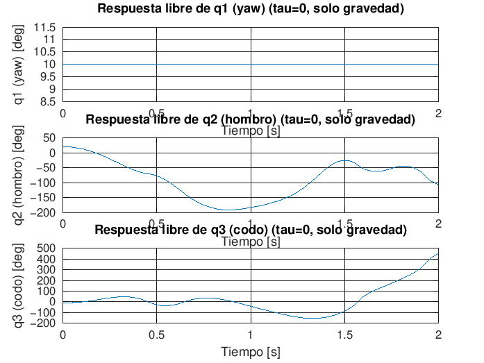
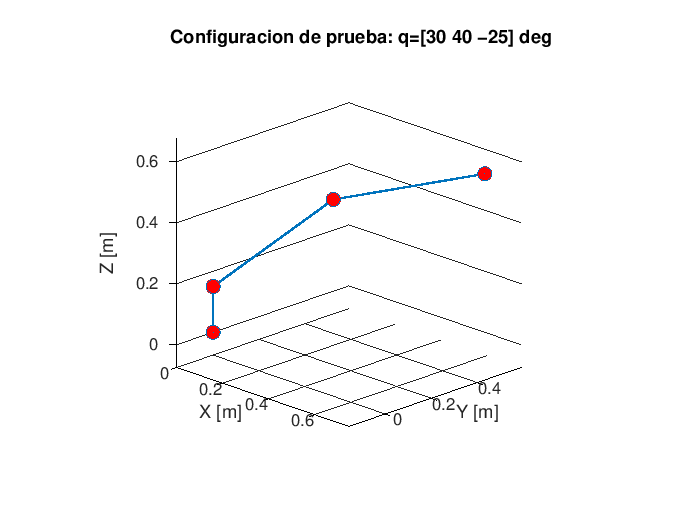
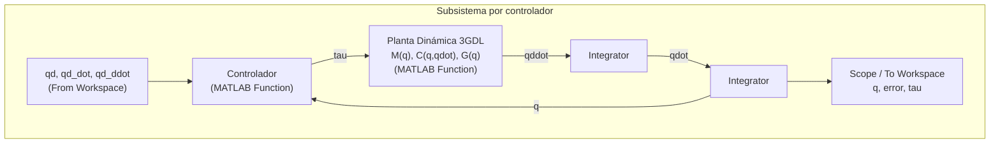

# Trabajo Final — Robot Antropomórfico 3 GDL

Control de un robot antropomórfico de 3 grados de libertad: modelo dinámico
por Jacobianos, tres controladores articulares y planeación autónoma con
obstáculos. Curso: Robótica y Sistemas Autónomos.

---

## 1. Punto de partida

El proyecto parte del trabajo parcial:

```text
00_base_parcial/robot3dof_paper_TParcial_g2.m
```

De ese archivo se conserva, sin modificar, la base cinemática validada:

- Cinemática directa por parámetros DH (`fk_3dof`).
- Cinemática inversa geométrica (`ik_3dof`).
- Jacobiano translacional del efector y análisis de singularidades
  (`jacobian_3dof`).
- Control cinemático por pseudoinversa amortiguada.

Geometría del robot (tomada del paper base): `L1 = 0.15 m`, `L2 = 0.50 m`,
`L3 = 0.50 m`.

## 2. Extensión para el trabajo final

**Requisito metodológico:** el modelo dinámico no se deriva por Lagrange.
Se obtiene por el método de Jacobianos lineales y angulares de los centros
de masa; la matriz de Coriolis se obtiene con coeficientes de Christoffel
(`n = 3`); los tres controladores se implementan en Simulink.

### 2.1. Modelo dinámico por Jacobianos

Archivo: [`01_codigo_final/robot3dof_TFinal_v2_dinamica_jacobianos.m`](01_codigo_final/robot3dof_TFinal_v2_dinamica_jacobianos.m)

Para cada eslabón *i* se calcula:

- **Centro de masa** `pc_i(q)`.
- **Jacobiano lineal** `Jv_i = d(pc_i)/dq`.
- **Jacobiano angular** `Jw_i` (columnas = ejes de giro de las juntas que
  afectan al eslabón *i*; cero en las juntas posteriores).

Con eso:

```text
M(q)      = Σ_i [ m_i · Jv_i' · Jv_i  +  Jw_i' · R_i · I_i · R_i' · Jw_i ]
C(q,qdot) = coeficientes de Christoffel de M(q), n = 3
G(q)      = d/dq [ Σ_i m_i · g · pc_i,z(q) ]
```

`C(q,qdot)` tiene dos implementaciones equivalentes:

1. **Simbólica** (`coriolis_christoffel`, con `sym`/`diff`) — para
   verificación y para el informe.
2. **Numérica** (diferencias centrales sobre `M(q)`, sin Symbolic Math
   Toolbox) — para la simulación y para los bloques `MATLAB Function` de
   Simulink, que no admiten código simbólico.

Ambas implementaciones coinciden con un error del orden de `1e-10` en el
punto de prueba de la Sección 2.3.

### 2.2. Parámetros del paper y supuestos físicos

La Tabla 2 del paper base (pág. 8, "List of parameters of robot manipulator")
reporta explícitamente longitudes, masas y gravedad:

| Parámetro | Valor | Fuente |
|---|---|---|
| `L1, L2, L3` | 0.15, 0.50, 0.50 m | Tabla 2 del paper (dato reportado) |
| `m1, m2, m3` | 0.50, 0.50, 0.50 kg | Tabla 2 del paper (dato reportado) |
| `g` | 9.81 m/s² | Tabla 2 del paper (dato reportado) |

El paper no reporta el valor numérico del centro de masa ni el tensor de
inercia completo de cada eslabón (solo aparecen símbolos genéricos como
`lc2`, `lc3`, `r1` dentro de las ecuaciones de Lagrange (10)-(12), sin
valores en la Tabla 2). Estos dos parámetros sí son supuestos de
simulación, documentados en el encabezado del archivo:

| Parámetro | Valor asumido | Justificación |
|---|---|---|
| `lc1, lc2, lc3` | `L_i / 2` | Eslabón uniforme → centro de masa a mitad de longitud |
| `I1, I2, I3` | Varilla delgada (`m·L²/12` transversal, ~0 axial) | Aproximación estándar para eslabones esbeltos; el eje "axial" de cada tensor se dedujo de la geometría DH (no arbitrario, ver comentarios en el código) |

Estos dos supuestos corresponden a la pregunta 1 de la Sección 6.

### 2.3. Resultados de validación numérica

Punto de prueba: `q = [30°, 40°, −25°]`, `qdot = [5°, −3°, 4°]/s`.

**M(q)** — simétrica, autovalores `[0.0106, 0.2293, 0.3527]` (definida positiva):

```text
 0.2293   0.0000   0.0000
 0.0000   0.3216   0.0983
 0.0000   0.0983   0.0417
```

**C(q,qdot):**

```text
 0.0059  -0.0125  -0.0020
 0.0125   0.0018   0.0005
 0.0020   0.0014   0.0000
```

**G(q)** — `G1 = 0` exactamente (el giro de base no cambia energía potencial):

```text
 0.0000
 4.0026
 1.1845
```

La derivación simbólica (Symbolic Math Toolbox) y la implementación
numérica cerrada coinciden en este punto. La verificación se repitió con
inercias transversales asimétricas (`I2 = diag([~0, 10, 20])`) para
descartar errores de orientación en las matrices de rotación; el resultado
se mantuvo consistente.

**Verificación física — dinámica libre (τ = 0):** partiendo de
`q0 = [10°, 20°, −10°]` sin controlador, el sistema debe comportarse como un
péndulo doble no amortiguado bajo gravedad.



`q2` y `q3` oscilan sin amortiguamiento, consistente con la ausencia de
término disipativo en el modelo (energía mecánica conservada). `q1` no
permanece constante pese a `G1 = 0` y velocidad inicial nula: el
acoplamiento de Coriolis `C(1,2)`, `C(1,3)` transmite el movimiento de
`q2`/`q3` hacia `q1`, efecto de conservación de momento angular que el
método de Jacobianos captura y que el modelo simplificado usado en la
versión preliminar (v1) no reproducía.

**Configuración cinemática de prueba:**



### 2.4. Los tres controladores

Archivo (pendiente de reescritura con la dinámica de Jacobianos):
[`01_codigo_final/robot3dof_TFinal_v3_controladores.m`](01_codigo_final/robot3dof_TFinal_v3_controladores.m)

| Controlador | Ley | Uso |
|---|---|---|
| PID no lineal | `τ = Kp·e + Kd·ė + Ki·∫e + G(q)` | Control de posición/regulación |
| PD con precompensación | `τ = M(qd)·q̈d + C(qd,q̇d)·q̇d + G(qd) + Kp·e + Kd·ė` | Seguimiento de trayectoria |
| Par calculado | `τ = M(q)·(q̈d + Kd·ė + Kp·e) + C(q,q̇)·q̇ + G(q)` | Seguimiento de trayectoria; controlador principal de la comparación final |

### 2.5. Modelo Simulink

Archivo generador: [`01_codigo_final/crear_modelo_simulink_robot3gdl.m`](01_codigo_final/crear_modelo_simulink_robot3gdl.m).
Genera `Robot3GDL_Control_Final.slx` y la carpeta `simulink_blocks/` con el
código de cada bloque `MATLAB Function`.



El modelo contiene tres subsistemas (`PID_NoLineal`, `PD_Precomp`,
`Par_Calculado`), simulados con la misma `qd(t)` para comparación directa.

El script construye el `.slx` mediante la API de Simulink
(`new_system`/`add_block`/`add_line`). Si la construcción automática falla,
deja preparadas todas las variables y los 4 archivos de bloques necesarios
para el armado manual, documentado en
[`05_anexos/guia_armado_simulink_robot3gdl.md`](05_anexos/guia_armado_simulink_robot3gdl.md).

## 3. Trazabilidad: parcial vs. trabajo final

| Viene del parcial (sin modificar) | Se agrega para el trabajo final |
|---|---|
| `L1, L2, L3` | `m1, m2, m3`, `g` (Tabla 2 del paper, no extraídos en el parcial) |
| `fk_3dof`, `ik_3dof`, `jacobian_3dof` | `pc_i`, `Jv_i`, `Jw_i` |
| Análisis de singularidades | `M(q)`, `C(q,qdot)`, `G(q)` por Jacobianos + Christoffel |
| Control cinemático por pseudoinversa | 3 controladores dinámicos (PID no lineal, PD precomp., par calculado) |
| — | Centros de masa y tensores de inercia (supuestos, paper no los reporta) |
| — | Modelo Simulink (`Robot3GDL_Control_Final.slx`) |
| — | Planeación autónoma con obstáculos (A*, pendiente — Sección 6) |

## 4. Procedimiento de reproducción

```matlab
cd 01_codigo_final

% 1) Dinámica: calcula M(q), C(q,qdot), G(q) y ejecuta la verificación de caída libre
robot3dof_TFinal_v2_dinamica_jacobianos

% 2) Simulink: prepara el workspace y genera el .slx
crear_modelo_simulink_robot3gdl

% 3) Si el .slx no se genera automáticamente, armar siguiendo:
%    05_anexos/guia_armado_simulink_robot3gdl.md

% 4) Simular los tres subsistemas
sim('Robot3GDL_Control_Final');
```

Criterios de aceptación por paso:

1. **Paso 1:** ejecución sin errores; los tres autovalores de `M(q)` deben
   ser positivos; con Symbolic Math Toolbox disponible, la diferencia
   numérico-simbólica debe ser del orden de `1e-10` o menor.
2. **Paso 2:** `Robot3GDL_Control_Final.slx` debe aparecer en
   `01_codigo_final/`. Un aviso de generación automática fallida no impide
   continuar con el Paso 3 (armado manual).
3. **Paso 4:** exporta `q_pid_out`, `q_pd_out`, `q_ct_out`, `tau_pid_out`,
   `tau_pd_out`, `tau_ct_out` al workspace, insumo para el error articular
   y la tabla comparativa (guía, Sección 6).

## 5. Estado y pendientes

- Dinámica (`v2_dinamica_jacobianos.m`): validada matemáticamente por dos
  métodos independientes (simbólico y numérico). Pendiente: ejecución
  íntegra en MATLAB antes de la entrega final.
- Modelo Simulink (`crear_modelo_simulink_robot3gdl.m`): construido según
  la API estándar de Simulink. Pendiente: verificación de la generación
  automática del `.slx` en Simulink; la guía manual
  (`guia_armado_simulink_robot3gdl.md`) es la vía de respaldo.
- `robot3dof_TFinal_v3_controladores.m` y
  `robot3dof_TFinal_v4_astar_obstaculos.m` usan una versión anterior y más
  simple de la dinámica (no la de Jacobianos). Pendiente: reescribirlos
  reutilizando `inertia_matrix_3dof`, `coriolis_matrix_3dof`,
  `gravity_vector_3dof` de `v2_dinamica_jacobianos.m`.
- Planeación autónoma con obstáculos (A*): pendiente de integrar con el
  modelo dinámico actual.

## 6. Preguntas pendientes para el docente

1. El paper base reporta masas y gravedad (Tabla 2), pero no reporta el
   centro de masa ni el tensor de inercia completo de cada eslabón. ¿Se
   aceptan como supuestos de simulación, declarados explícitamente?
2. Los tensores de inercia se modelan como varilla delgada uniforme
   (momento axial ≈ 0, transversal `m·L²/12`). ¿Es aceptable esta
   aproximación, o se espera un modelo más detallado (p. ej. cilindro
   sólido)?
3. `C(q,qdot)` tiene una implementación numérica (diferencias finitas sobre
   `M(q)`) para los bloques `MATLAB Function` de Simulink, que no admiten
   `sym`/`diff`. Se verificó que coincide con la versión simbólica exacta.
   ¿Es aceptable esta variante para la parte que corre en Simulink?
4. ¿Los bloques `MATLAB Function` de Simulink pueden llamar a funciones
   numéricas externas, o el código debe quedar completamente en línea
   dentro de cada bloque?
5. ¿La comparación final debe reportar error articular, error cartesiano
   del efector, o ambos?
6. ¿El PID no lineal debe incluir saturación de torque y anti-windup?
7. ¿La trayectoria con obstáculos puede planearse en MATLAB con A* en el
   plano cartesiano y convertirse a trayectoria articular por cinemática
   inversa antes de enviarla a Simulink?

## 7. Estructura del repositorio

```text
00_base_parcial/       Archivo del trabajo parcial (cinemática base, sin modificar)
01_codigo_final/       Código MATLAB del trabajo final (dinámica, Simulink, controladores, A*)
02_resultados/         Gráficas, tablas comparativas
03_informe/            Informe final (pendiente)
04_presentacion/       Presentación (pendiente)
05_anexos/             Guía de armado de Simulink, ecuaciones, capturas
```
