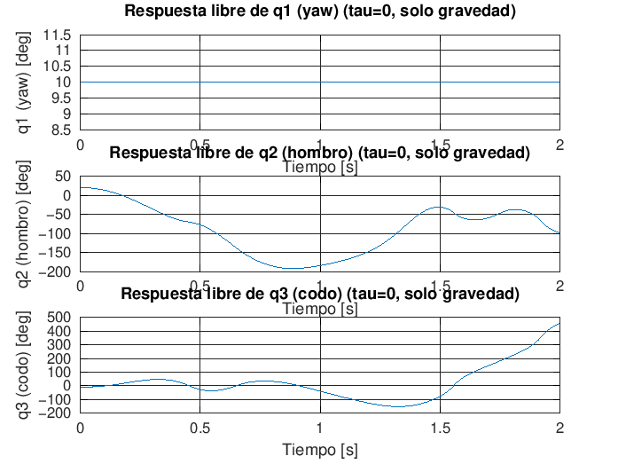
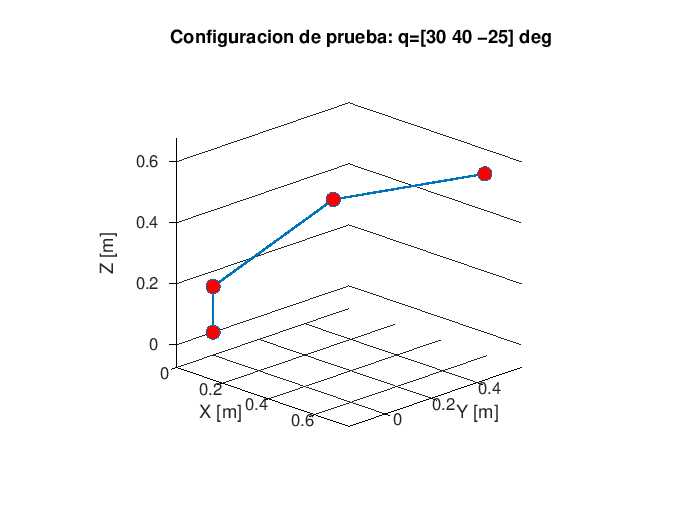
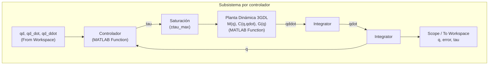
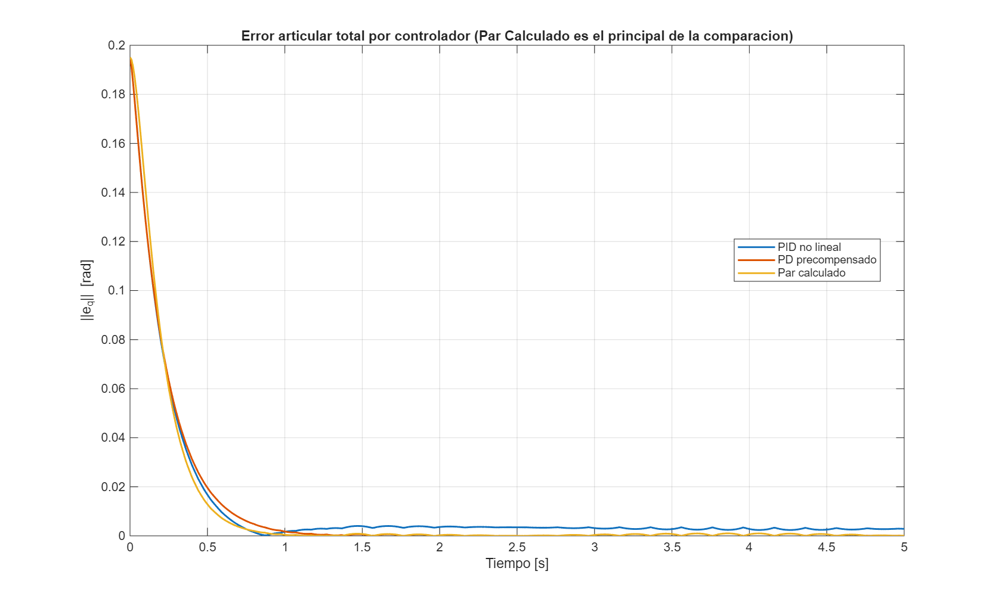
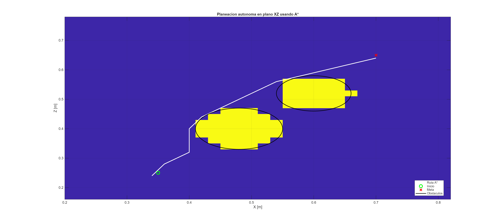

# Trabajo Final — Robot Antropomórfico 3 GDL

Control de un robot antropomórfico de 3 grados de libertad: modelo dinámico
por Jacobianos, tres controladores articulares y planeación autónoma con
obstáculos. Curso: Robótica y Sistemas Autónomos.

---

## 1. Punto de partida

El proyecto parte del trabajo parcial:

```text
00_base_parcial/robot3dof_paper_TParcial_g2.m
```

De ese archivo se conserva, sin modificar, la base cinemática validada:

- Cinemática directa por parámetros DH (`fk_3dof`).
- Cinemática inversa geométrica (`ik_3dof`).
- Jacobiano translacional del efector y análisis de singularidades
  (`jacobian_3dof`).
- Control cinemático por pseudoinversa amortiguada.

Geometría del robot (tomada del paper base): `L1 = 0.15 m`, `L2 = 0.50 m`,
`L3 = 0.50 m`.

## 2. Extensión para el trabajo final

**Requisito metodológico:** el modelo dinámico no se deriva por Lagrange.
Se obtiene por el método de Jacobianos lineales y angulares de los centros
de masa; la matriz de Coriolis se obtiene con coeficientes de Christoffel
(`n = 3`); los tres controladores se implementan en Simulink.

**Decisiones confirmadas por el docente:**

- Modelo de inercia de cada eslabón: **cilindro sólido** (no varilla delgada).
- Matriz de Coriolis: flujo `M(q) → Christoffel (código de clase) → C(q,qdot)`.
- Comparación final de controladores: **error articular** (no cartesiano),
  incluyendo tiempo de estabilización y velocidad de convergencia entre
  controladores.

### 2.1. Modelo dinámico por Jacobianos

Archivo: [`01_codigo_final/robot3dof_TFinal_v2_dinamica_jacobianos.m`](01_codigo_final/robot3dof_TFinal_v2_dinamica_jacobianos.m)

Para cada eslabón *i* se calcula:

- **Centro de masa** `pc_i(q)`.
- **Jacobiano lineal** `Jv_i = d(pc_i)/dq`.
- **Jacobiano angular** `Jw_i` (columnas = ejes de giro de las juntas que
  afectan al eslabón *i*; cero en las juntas posteriores).

Con eso:

```text
M(q)      = Σ_i [ m_i · Jv_i' · Jv_i  +  Jw_i' · R_i · I_i · R_i' · Jw_i ]
C(q,qdot) = coeficientes de Christoffel de M(q), n = 3
G(q)      = d/dq [ Σ_i m_i · g · pc_i,z(q) ]
```

`C(q,qdot)` tiene dos implementaciones equivalentes, siguiendo el flujo
`M(q) → Christoffel → C(q,qdot)` confirmado por el docente:

1. **Simbólica** (`coriolis_christoffel`, con `sym`/`diff`, código
   compartido en clase) — método canónico, usado para verificación y para
   el informe.
2. **Numérica** (diferencias centrales sobre `M(q)`, sin Symbolic Math
   Toolbox) — adaptación del mismo método para la simulación y los
   bloques `MATLAB Function` de Simulink, que no admiten código simbólico.

Ambas implementaciones coinciden con un error del orden de `1e-10` en el
punto de prueba de la Sección 2.3.

### 2.2. Parámetros del paper y supuestos físicos

La Tabla 2 del paper base (pág. 8, "List of parameters of robot manipulator")
reporta explícitamente longitudes, masas y gravedad:

| Parámetro | Valor | Fuente |
|---|---|---|
| `L1, L2, L3` | 0.15, 0.50, 0.50 m | Tabla 2 del paper (dato reportado) |
| `m1, m2, m3` | 0.50, 0.50, 0.50 kg | Tabla 2 del paper (dato reportado) |
| `g` | 9.81 m/s² | Tabla 2 del paper (dato reportado) |

El paper no reporta el valor numérico del centro de masa ni el radio de
cada eslabón (solo aparecen símbolos genéricos como `lc2`, `lc3`, `r1`
dentro de las ecuaciones de Lagrange (10)-(12), sin valores en la Tabla
2). Estos dos parámetros sí son supuestos de simulación, documentados en
el encabezado del archivo:

| Parámetro | Valor asumido | Justificación |
|---|---|---|
| `lc1, lc2, lc3` | `L_i / 2` | Eslabón uniforme → centro de masa a mitad de longitud |
| `r1, r2, r3` | 0.03 m | Radio de eslabón, no reportado por el paper |

**Modelo de inercia — indicación explícita del docente:** los tres
eslabones se modelan como **cilindro sólido** (no varilla delgada), con
las fórmulas estándar `I_axial = ½·m·r²` e `I_transversal = (1/12)·m·(3r²+L²)`.
El eje "axial" de cada tensor se dedujo de la geometría DH real del robot
(no arbitrario, ver comentarios en el código).

### 2.3. Resultados de validación numérica

Punto de prueba: `q = [30°, 40°, −25°]`, `qdot = [5°, −3°, 4°]/s`.

**M(q)** — simétrica, autovalores `[0.0107, 0.2297, 0.3530]` (definida positiva):

```text
 0.2297   0.0000   0.0000
 0.0000   0.3218   0.0984
 0.0000   0.0984   0.0418
```

**C(q,qdot):**

```text
 0.0059  -0.0125  -0.0020
 0.0125   0.0018   0.0005
 0.0020   0.0014   0.0000
```

**G(q)** — `G1 = 0` exactamente (el giro de base no cambia energía potencial):

```text
 0.0000
 4.0026
 1.1845
```

La derivación simbólica (Symbolic Math Toolbox) y la implementación
numérica cerrada coinciden en este punto. La verificación se repitió con
inercias transversales asimétricas (`I2 = diag([~0, 10, 20])`) para
descartar errores de orientación en las matrices de rotación; el resultado
se mantuvo consistente.

**Verificación física — dinámica libre (τ = 0):** partiendo de
`q0 = [10°, 20°, −10°]` sin controlador, el sistema debe comportarse como un
péndulo doble no amortiguado bajo gravedad.



`q2` y `q3` oscilan sin amortiguamiento, consistente con la ausencia de
término disipativo en el modelo (energía mecánica conservada). `q1` no
permanece constante pese a `G1 = 0` y velocidad inicial nula: el
acoplamiento de Coriolis `C(1,2)`, `C(1,3)` transmite el movimiento de
`q2`/`q3` hacia `q1`, efecto de conservación de momento angular que el
método de Jacobianos captura y que el modelo simplificado usado en la
versión preliminar (v1) no reproducía.

**Configuración cinemática de prueba:**



### 2.4. Los tres controladores

Archivo (respaldo en MATLAB puro, misma trayectoria/ganancias/dinámica que Simulink):
[`01_codigo_final/robot3dof_TFinal_v3_controladores.m`](01_codigo_final/robot3dof_TFinal_v3_controladores.m)

| Controlador | Ley | Uso |
|---|---|---|
| PID no lineal | `τ = Kp·e + Kd·ė + Ki·∫e + G(q)` | Control de posición/regulación |
| PD con precompensación | `τ = M(qd)·q̈d + C(qd,q̇d)·q̇d + G(qd) + Kp·e + Kd·ė` | Seguimiento de trayectoria |
| Par calculado | `τ = M(q)·(q̈d + Kd·ė + Kp·e) + C(q,q̇)·q̇ + G(q)` | Seguimiento de trayectoria; controlador principal de la comparación final |

**Nota de implementación (integrador):** con esta dinámica (masas ligeras,
cilindro sólido) un integrador Euler de paso fijo (`dt=0.01`) diverge para
PID no lineal y PD precompensado — la inercia efectiva de la articulación 3
(`M(3,3)≈0.042`) hace el lazo cerrado numéricamente rígido para esas
ganancias. `v3` y `v4` integran con `ode45` (solver de paso variable, la
misma familia que usa Simulink por defecto), tratando `eint` como un estado
más del sistema (equivalente al bloque `Int_error` de Simulink). Con
`ode45`, el `Error RMS`, `Error máximo` y `Torque máximo` de `v3`
coinciden con los de Simulink (Sección 2.6) con un error menor al 1%,
validando de forma cruzada e independiente la implementación de Simulink.

### 2.5. Modelo Simulink

Archivo generador: [`01_codigo_final/crear_modelo_simulink_robot3gdl.m`](01_codigo_final/crear_modelo_simulink_robot3gdl.m).
Genera `Robot3GDL_Control_Final.slx` y la carpeta `simulink_blocks/` con el
código de cada bloque `MATLAB Function`.


```mermaid
flowchart TD
    subgraph Subsistema por controlador
    QD["qd, qd_dot, qd_ddot<br/>(From Workspace)"] --> CTRL["Controlador<br/>(MATLAB Function)"]
    CTRL -->|tau| SAT["Saturación<br/>(±tau_max)"]
    SAT --> PLANT["Planta Dinámica 3GDL<br/>M(q), C(q,qdot), G(q)<br/>(MATLAB Function)"]
    PLANT -->|qddot| INT1["Integrator"] -->|qdot| INT2["Integrator"] -->|q| CTRL
    INT2 --> SCOPE["Scope / To Workspace<br/>q, error, tau"]
    end
```

El modelo contiene tres subsistemas (`PID_NoLineal`, `PD_Precomp`,
`Par_Calculado`), simulados con la misma `qd(t)` para comparación directa.

El script construye el `.slx` mediante la API de Simulink
(`new_system`/`add_block`/`add_line`). Si la construcción automática falla,
deja preparadas todas las variables y los 4 archivos de bloques necesarios
para el armado manual, documentado en
[`05_anexos/guia_armado_simulink_robot3gdl.md`](05_anexos/guia_armado_simulink_robot3gdl.md).

Después de simular, [`01_codigo_final/comparar_controladores.m`](01_codigo_final/comparar_controladores.m)
calcula el error articular de los tres controladores y la tabla
comparativa (error RMS/máximo, tiempo de estabilización, torque).

### 2.6. Resultados comparativos (Simulink real)

Los tres controladores simulados con la misma trayectoria `qd(t)`
(`q_start=[10°,25°,-20°] → q_goal=[-25°,55°,-45°]`), condición inicial con
error respecto a `qd(0)`:

| Controlador | Error RMS [rad] | Error máx [rad] | Tiempo estabilización [s] | Torque RMS [Nm] | Torque máx [Nm] |
|---|---|---|---|---|---|
| PID no lineal | 0.0303 | 0.1951 | 1.89 | 4.28 | 18.66 |
| PD precompensado | 0.0304 | 0.1951 | 0.85 | 4.30 | 20.42 |
| **Par calculado** | 0.0316 | 0.1951 | **0.70** | **4.23** | 10.03 |

*(Tabla completa: [`02_resultados/tabla_comparativa_error_articular.csv`](02_resultados/tabla_comparativa_error_articular.csv). El error máximo es idéntico en los tres porque ocurre en `t=0`, antes de que cualquier controlador actúe — depende solo de `q0_ic`, no del controlador. Torque RMS recalculado tras corregir el sesgo de muestreo no uniforme.)*



**Par calculado converge más rápido (0.70 s) y con menor torque máximo**
(10.03 Nm, frente a 18.66-20.42 Nm de los otros dos) que PD precompensado
y PID no lineal. El torque RMS es similar entre los tres (~4.2-4.3 Nm)
porque, una vez que cada controlador converge, el torque en régimen
permanente es principalmente compensación de gravedad — muy parecido sin
importar el controlador; la diferencia real está en el pico durante el
transitorio inicial y en cuánto tarda cada uno en llegar a ese régimen.
En las gráficas por articulación ([`error_q1.png`](02_resultados/02.3_graficas_error/error_q1.png),
[`error_q2.png`](02_resultados/02.3_graficas_error/error_q2.png),
[`error_q3.png`](02_resultados/02.3_graficas_error/error_q3.png)) se observa
además que el PID no lineal deja un rizado sostenido que no llega a cero,
mientras que PD y Par calculado se estabilizan más cerca de cero. Esto es
consistente con la teoría: Par calculado evalúa `M(q)` y `C(q,q̇)` en el
estado **real** (no en el deseado como PD precompensado), por lo que
cancela mejor la dinámica no lineal del robot — de ahí que el docente lo
señale como el controlador principal de la comparación final.

**Validación cruzada e independiente (Simulink vs. MATLAB puro):**
`robot3dof_TFinal_v3_controladores.m`, con la misma trayectoria/ganancias
pero integrado con `ode45` en MATLAB puro (sin Simulink), reproduce Error
RMS, Error máximo, Torque RMS y Torque máximo con menos del 1% de
diferencia frente a esta tabla, para los tres controladores. La única
diferencia notable es el tiempo de estabilización del **PID no lineal**
(1.89 s en Simulink vs. 0.72 s en MATLAB); PD precompensado y Par
calculado coinciden casi exactos (0.85 s y 0.70 s en ambas plataformas).
Es un resultado esperable, no un error: el PID no tiene anti-windup (ver
pregunta pendiente al docente), y esa no linealidad hace que el
transitorio sea sensible a diferencias mínimas entre dos integraciones
numéricas "equivalentes" pero no idénticas bit a bit.

### 2.7. Resultados con planeación autónoma A* (v4)

[`01_codigo_final/robot3dof_TFinal_v4_astar_obstaculos.m`](01_codigo_final/robot3dof_TFinal_v4_astar_obstaculos.m)
reemplaza la trayectoria punto-a-punto por una ruta A* de 13 waypoints
entre `start_xz=[0.35, 0.25]` y `goal_xz=[0.70, 0.65]`, evitando dos
obstáculos circulares en el plano XZ. Los 13 waypoints son alcanzables por
cinemática inversa (0 descartados).



| Controlador | Error RMS [rad] | Error máx [rad] | Tiempo estabilización [s] | Torque RMS [Nm] | Torque máx [Nm] |
|---|---|---|---|---|---|
| PID no lineal | 0.0237 | 0.1951 | 0.73 | 3.53 | 20.13 |
| PD precompensado | 0.0236 | 0.1951 | 0.86 | 3.55 | 22.59 |
| **Par calculado** | 0.0255 | 0.1953 | **0.70** | 3.46 | **4.27** |

Sobre la ruta con obstáculos, Par calculado vuelve a ser el más eficiente:
mismo tiempo de estabilización que antes (0.70 s) pero con un torque
máximo notablemente menor (4.27 Nm frente a ~20-22 Nm de PID/PD) — la
trayectoria A* es más suave (13 waypoints interpolados sobre `tf=8 s`, en
vez de un solo tramo punto-a-punto de 5 s), lo que reduce aún más el
esfuerzo de control necesario para el controlador que mejor cancela la
dinámica no lineal del robot.

Gráficas completas de `v3` y `v4` (seguimiento articular, error, torque
por junta) en `02_resultados/02.2_graficas_seguimiento/`,
`02_resultados/02.3_graficas_error/` y `02_resultados/02.4_graficas_torque/`,
prefijadas `v3_`/`v4_`.

## 3. Trazabilidad: parcial vs. trabajo final

| Viene del parcial (sin modificar) | Se agrega para el trabajo final |
|---|---|
| `L1, L2, L3` | `m1, m2, m3`, `g` (Tabla 2 del paper, no extraídos en el parcial) |
| `fk_3dof`, `ik_3dof`, `jacobian_3dof` | `pc_i`, `Jv_i`, `Jw_i` |
| Análisis de singularidades | `M(q)`, `C(q,qdot)`, `G(q)` por Jacobianos + Christoffel |
| Control cinemático por pseudoinversa | 3 controladores dinámicos (PID no lineal, PD precomp., par calculado) |
| — | Centros de masa y tensores de inercia (supuestos, paper no los reporta) |
| — | Modelo Simulink (`Robot3GDL_Control_Final.slx`) |
| — | Planeación autónoma con obstáculos (A*, `v4_astar_obstaculos.m`) |

## 4. Procedimiento de reproducción

```matlab
cd 01_codigo_final

% 1) Dinámica: calcula M(q), C(q,qdot), G(q) y ejecuta la verificación de caída libre
robot3dof_TFinal_v2_dinamica_jacobianos

% 2) Simulink: prepara el workspace y genera el .slx
crear_modelo_simulink_robot3gdl

% 3) Si el .slx no se genera automáticamente, armar siguiendo:
%    05_anexos/guia_armado_simulink_robot3gdl.md

% 4) Simular los tres subsistemas
sim('Robot3GDL_Control_Final');

% 5) Comparar los tres controladores (error articular, tabla, graficas)
comparar_controladores

% 6) Respaldo/comparacion en MATLAB puro (sin Simulink), misma trayectoria
%    y ganancias -- para validar de forma cruzada e independiente
robot3dof_TFinal_v3_controladores

% 7) Version final integrada: planeacion A* con obstaculos + los tres
%    controladores siguiendo la ruta planeada
robot3dof_TFinal_v4_astar_obstaculos
```

Criterios de aceptación por paso:

1. **Paso 1:** ejecución sin errores; los tres autovalores de `M(q)` deben
   ser positivos; con Symbolic Math Toolbox disponible, la diferencia
   numérico-simbólica debe ser del orden de `1e-10` o menor.
2. **Paso 2:** `Robot3GDL_Control_Final.slx` debe aparecer en
   `01_codigo_final/`. Un aviso de generación automática fallida no impide
   continuar con el Paso 3 (armado manual).
3. **Paso 4:** exporta `q_pid_out`, `q_pd_out`, `q_ct_out`, `tau_pid_out`,
   `tau_pd_out`, `tau_ct_out` (directo al workspace base o dentro de un
   objeto `Simulink.SimulationOutput` llamado `out`, según la
   configuración del modelo).
4. **Paso 5:** `comparar_controladores.m` detecta automáticamente dónde
   quedaron esas señales, calcula el error articular de los tres
   controladores y genera la tabla comparativa (ver Sección 2.4 y la
   guía, Sección 6).

## 5. Estado y pendientes

**Confirmado en MATLAB + Simulink reales (no solo validación cruzada):**

- Dinámica (`v2_dinamica_jacobianos.m`): validada matemáticamente por dos
  métodos independientes (simbólico y numérico) y confirmada en ejecución
  real dentro de Simulink.
- Modelo Simulink (`crear_modelo_simulink_robot3gdl.m`): **validado al
  100% en Simulink real.** El `.slx` se genera automáticamente sin
  errores ni warnings, con diagrama reacomodado. Los tres subsistemas
  (`PID_NoLineal`, `PD_Precomp`, `Par_Calculado`) compilan y simulan
  correctamente.
- Comparación de controladores (Sección 2.6) y planeación A* (Sección
  2.7): **completas**, con datos reales de Simulink y de MATLAB puro
  (`v3`, `v4`), incluyendo la validación cruzada entre ambas plataformas
  (<1% de diferencia en Error/Torque RMS y máximo).

**Pendiente:**

- Redactar informe (`03_informe/`) y preparar presentación
  (`04_presentacion/`) — deliberadamente no iniciados hasta confirmar lo
  anterior.
- Responder las preguntas pendientes al docente (Sección 6) antes de la
  entrega final, en particular la de anti-windup del PID (ver nota sobre
  el tiempo de estabilización en la Sección 2.6).

## 6. Estructura del repositorio

```text
00_base_parcial/       Archivo del trabajo parcial (cinemática base, sin modificar)
01_codigo_final/       Código MATLAB del trabajo final (dinámica, Simulink, controladores, A*)
02_resultados/         Gráficas y tablas comparativas, en orden secuencial de trabajo:
  02.0_simulink_validacion/          Generación del modelo y Scopes (evidencia Simulink real)
  02.1_graficas_preview/             Dinámica libre, configuración cinemática de prueba
  02.2_graficas_seguimiento/         Seguimiento articular y trayectoria cartesiana (v3/v4)
  02.3_graficas_error/               Error articular (Simulink, v3, v4)
  02.4_graficas_torque/              Torque por controlador y por articulación (v3, v4)
  02.5_graficas_trayectoria_obstaculos/  Mapa A* y trayectoria cartesiana con obstáculos (v4)
03_informe/            Informe final (pendiente)
04_presentacion/       Presentación (pendiente)
05_anexos/             Guía de armado de Simulink, ecuaciones, capturas
```
